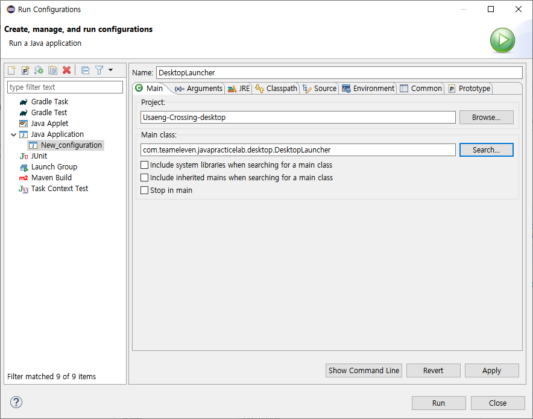

# JAVA Programming Lab (SWE2023)

**Final Project**

---

## Contents

- [Installation](#installation)
- [Documentation](#Documentation)

---

## Installation

### Prerequistes
- Java JDK
- Eclipse (or Intellij, Netbeans, etc...)

### 1. Prepare or clone project.
```shell
$ git clone https://github.com/BestevenSKKU/java-programming-lab-final-project.git
```

### 2. Import Package (Eclipse based)
1. Open Eclipse
2. File -> import -> Gradle -> Existing Gradle project
3. Set the attached **java-programming-lab-final-project** folder as the project root directory
4. if **Usaeng-Crossing-core**, **Usaeng-Crossing-desktop**, and **java-programming-lab-final-project** have been created, the environment is ready

### 3-1. Run Project
1. Open Run Configurations
2. Craete New Java Application
    - Name : DesktopLauncher
    - Project : Usaeng-Crossing-desktop
    - Main class : com.teameleven.javapracticelab.desktop.DesktopLauncher
    

3. Run
4. If you want to enter server to play multi-player mode, enter **usaeng-crossing.kro.kr**. It is test public server.
    - Note: Do not type **http://**. Only input domain or ip.
    - Or you can make your own server following ___3-2. Run Own Server___ Part
    
### 3-2. Run Own Server (optional)
#### 1) Run with node.js
1. Enter server/ directory
2. Open terminal
3. Run
    ```shell
   $ npm install
   $ npm start
    ```
4. Access 127.0.0.1:8080 at multi-player mode

#### 2) Run without node.js (Use Execute File)
1. Enter server/ directory
2. Open terminal
3. Run index-win.exe
4. Access 127.0.0.1:8080 at multi-player mode

### 4. Game Guide
- This game is based on the recently famous game Animal crossing(모여봐요 동물의 숲).
- In this game, players move to an island and have a new life. 
- You can get fruits from trees or make tools from various materials. 
- Fishing is also possible in the sea and in the pond! 
- On the island, not only you, but 3 inhabitants live together. 
- They will welcome you and sometimes even give gifts! 
- Create your own game!

---

## Documentation

### Development Language
- Java
- Node.js

### Game Engine
- [`libgdx`](https://libgdx.badlogicgames.com/)

### Server
- [`Express`](https://expressjs.com/ko/)
- [`socket.io`](https://socket.io/)


---

Copyright ⓒ 2020 **Group 11** All Right Reserved
